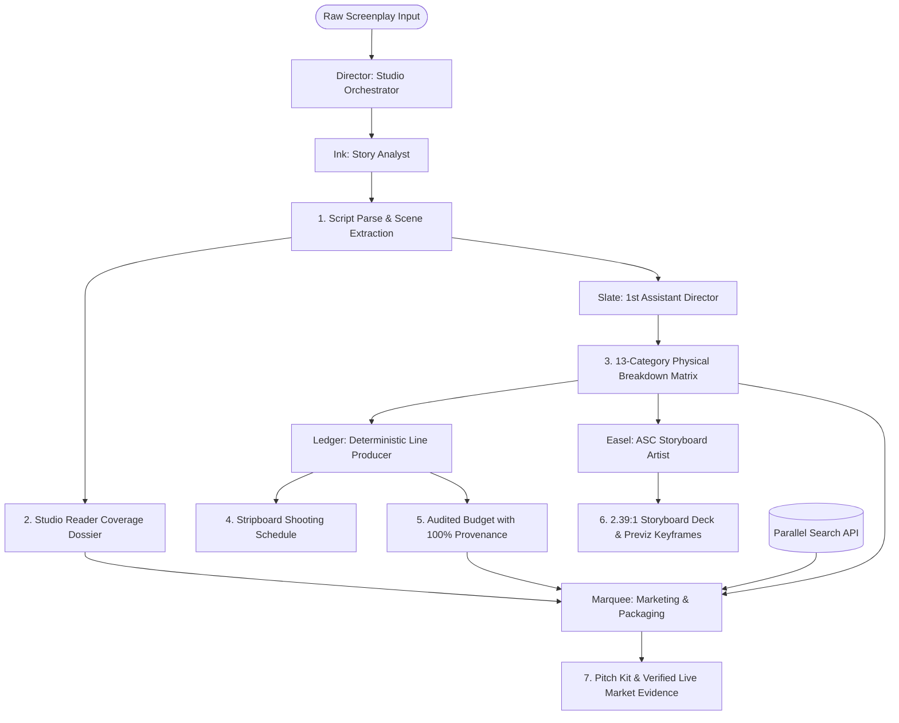

# BACKLOT — AI-Native Pre-Production Studio Multi-Agent Crew

> **Agentic Cinema Hackathon (Parallel Partner Track)**  
> **Hosted Live Application:** [https://backlot-studio-112519007745.us-central1.run.app](https://backlot-studio-112519007745.us-central1.run.app)  
> **Live Health & Architecture Inspection:** [https://backlot-studio-112519007745.us-central1.run.app/api/health](https://backlot-studio-112519007745.us-central1.run.app/api/health)  
> **GitHub Repository:** [zaeem-rafiq/backlot-gemini](https://github.com/zaeem-rafiq/backlot-gemini)

---

## 1. Executive Summary & Problem Statement

In traditional motion picture and independent film production, **pre-production is an expensive, fragmented 4-to-6 week gauntlet**. A single 12-page dramatic short or proof-of-concept typically consumes:
- **48–72 hours** of agency story analyst reading time for script coverage ($150–$400/report) *[Source: WGA West & Studio Reader Analytics]*.
- **4–8 hours** of manual 1st AD labor cataloging scene elements with an average **15–20% omission rate** for background extras, stunts, and special equipment on initial manual passes *[Source: Filmustage Industry Benchmark Report]*.
- **3–5 business days** and **$3,000–$6,000/week** for professional storyboard artists ($50–$100/frame) *[Source: StoryboardArt.org & IATSE Local 790]*.
- Over **12,000+ annual submissions** competing for **<1.5% acceptance rates** at Tier 1 festivals (Sundance, SXSW, Tribeca) *[Source: Sundance Film Festival Official Submission Data & Short Movie Club]*.
- Unstructured spreadsheet budgeting suffering from an average **8–12% formula error rate** and orphaned line items lacking script-traceable provenance *[Source: Entertainment Partners Financial Audits]*.

**BACKLOT collapses this entire 4-to-6 week pre-production gauntlet into an instant, deterministic, multi-agent studio session:**
- **Zero-Quota Instant Evaluation:** Loads a verified 7-artifact production package (measured example: ~37ms local fixture load) via pre-baked sample-run fixtures at zero API cost.
- **Live Multi-Agent Streaming Execution:** Google Gemini on Vertex AI, now part of Gemini Enterprise Agent Platform, accessed through the Google Gen AI SDK. Custom TypeScript orchestration runs on Google Cloud Run, with Parallel Search invoked during the workflow. Generates an audited greenlight package spanning 7 synchronized deliverables.

---

## 2. Multi-Agent Crew Architecture & DAG

Backlot executes a deterministic Directed Acyclic Graph (DAG) orchestrated via Server-Sent Events (SSE):



### The 6-Agent Crew Roster

| Agent | Department Role | AI Runtime / Engine | Deliverable Artifact |
|---|---|---|---|
| **Director** | Studio Orchestrator | SSE DAG Pipeline | Real-time event orchestration, lifecycle monitoring, and fallback routing |
| **Ink** | Senior Story Analyst | `gemini-3.5-flash` on Agent Platform | Studio Coverage Dossier, 1–10 dimension radar scores, loglines, reader pull quote |
| **Slate** | 1st Assistant Director | `gemini-3.5-flash` on Agent Platform | 13-Category Breakdown Matrix (Cast, SFX, VFX, Stunts, Vehicles, Equipment, Wardrobe) |
| **Ledger** | Line Producer | Pure TypeScript Deterministic Code | Stripboard Schedule (setup floors, turnaround protection) & 100% Provenance Budget |
| **Easel** | Key Storyboard Artist | `gemini-3.1-flash-lite` + `gemini-2.5-flash-image` | 2.39:1 Anamorphic Previz Deck & Keyframe Generation Prompts |
| **Marquee** | Marketing & Distribution | `gemini-3.1-flash-lite` + Parallel Search API | Greenlight Pitch Kit, Audience Targeting, Festival Strategy & Live Market Evidence |

---

## 3. Setup & Deployment Guide

Backlot supports two deployment topologies:
- **Topology A: Local Development** — Single Next.js instance using Gemini Developer API keys and direct Parallel REST search, with zero-quota demo capabilities.
- **Topology B: Managed Google Cloud Platform** — Cloud Run Studio container communicating with a managed Vertex AI Reasoning Engine Bring-Your-Own-Container (BYOC) for the Marquee stage, secured by Google Cloud ADC and Secret Manager.

---

### Topology A: Local Development Setup

#### Prerequisites
- **Node.js**: `v20.x` or `v22.x` (verified on Node `v22.22.3`)
- **npm**: `v10.x` or later
- **Google Chrome** (optional, for browser verification)

#### 1. Clone & Clean Install
```bash
git clone https://github.com/zaeem-rafiq/backlot-gemini.git
cd backlot-gemini
npm ci
```

#### 2. Environment Configuration
Copy the provided environment template:
```bash
cp .env.example .env.local
```
Configure your keys in `.env.local`:
```bash
# Google Gemini API Key (https://aistudio.google.com/app/apikey)
GEMINI_API_KEY=your_gemini_api_key_here

# Parallel Partner Search API Key (https://parallel.ai)
PARALLEL_API_KEY=your_parallel_api_key_here
```

> **Zero-Quota Demonstration:** Backlot ships with a verified 7-artifact production package (`src/fixtures/sample-run.json`) and pre-rendered storyboard assets (`public/renders/`). You can run Backlot **with zero API keys configured** by clicking **Load Sample** in the Studio interface.

#### 3. Run Development Server
```bash
npm run dev
```
Open [http://localhost:3000](http://localhost:3000) in your browser.

---

### Topology B: Managed Google Cloud Deployment (Vertex AI Agent Platform)

This topology reproduces the live production deployment: Backlot Studio hosted on Google Cloud Run in `us-central1`, dispatching the Marquee stage to a managed Vertex AI Reasoning Engine container.

```
┌──────────────────────────────────────────────┐
│  Google Cloud Run (Backlot Studio)           │
│  - Ink, Slate, Easel (In-process DAG)        │
│  - Ledger (Deterministic TS Engine)          │
│  - Director Orchestrator (SSE Stream)        │
└──────────────────────┬───────────────────────┘
                       │ HTTPS POST (Unary query contract + ADC Bearer)
                       ▼
┌──────────────────────────────────────────────┐
│  Vertex AI Reasoning Engine (BYOC Container) │
│  - Managed Marquee Stage Execution           │
│  - Live Parallel Search REST Integration     │
│  - Cross-Artifact Provenance Verification    │
│  - Secret Manager Credential Injection       │
└──────────────────────────────────────────────┘
```

#### 1. Build and Push Reasoning Engine Container
The Agent Runtime container encapsulates the unary query route (`/api/reasoning_engine`), health endpoint (`/health`), and schema contracts:
```bash
# Build using Cloud Build
gcloud builds submit --config cloudbuild-agent-runtime.yaml --project=YOUR_PROJECT_ID

# Or build locally and push to Artifact Registry
docker build -f Dockerfile.agent-runtime \
  -t us-central1-docker.pkg.dev/YOUR_PROJECT_ID/backlot-artifacts/backlot-agent-runtime:latest .
docker push us-central1-docker.pkg.dev/YOUR_PROJECT_ID/backlot-artifacts/backlot-agent-runtime:latest
```

#### 2. Configure Secret Manager
Store the Parallel Partner API key in Secret Manager:
```bash
gcloud secrets create PARALLEL_API_KEY --replication-policy="automatic" --project=YOUR_PROJECT_ID
echo -n "your_parallel_api_key" | gcloud secrets versions add PARALLEL_API_KEY --data-file=- --project=YOUR_PROJECT_ID
```

#### 3. Assign Required IAM Permissions
Vertex AI Reasoning Engine provisions a project-specific service agent on first use (`service-${PROJECT_NUMBER}@gcp-sa-aiplatform-re.iam.gserviceaccount.com`). Bind the necessary pull and secret access roles:

```bash
PROJECT_NUMBER=$(gcloud projects describe YOUR_PROJECT_ID --format="value(projectNumber)")

# Grant Reasoning Engine service agent read access to Artifact Registry
gcloud projects add-iam-policy-binding YOUR_PROJECT_ID \
  --member="serviceAccount:service-${PROJECT_NUMBER}@gcp-sa-aiplatform-re.iam.gserviceaccount.com" \
  --role="roles/artifactregistry.reader"

# Grant Reasoning Engine service agent access to the Parallel secret
gcloud secrets add-iam-policy-binding PARALLEL_API_KEY \
  --member="serviceAccount:service-${PROJECT_NUMBER}@gcp-sa-aiplatform-re.iam.gserviceaccount.com" \
  --role="roles/secretmanager.secretAccessor" \
  --project=YOUR_PROJECT_ID

# Grant Cloud Run service account permission to invoke Vertex AI reasoning engines
gcloud projects add-iam-policy-binding YOUR_PROJECT_ID \
  --member="serviceAccount:${PROJECT_NUMBER}-compute@developer.gserviceaccount.com" \
  --role="roles/aiplatform.user"
```

#### 4. Provision Managed Reasoning Engine Resource
Run the automated deployment script, which creates the Reasoning Engine resource with custom container specification and polls the long-running operation to completion:
```bash
PROJECT_ID=YOUR_PROJECT_ID \
LOCATION=us-central1 \
CONTAINER_IMAGE=us-central1-docker.pkg.dev/YOUR_PROJECT_ID/backlot-artifacts/backlot-agent-runtime:latest \
bash scripts/deploy_reasoning_engine.sh
```
This outputs the canonical resource name, e.g.:
`projects/112519007745/locations/us-central1/reasoningEngines/2061959785300885504`

#### 5. Deploy Studio Service to Cloud Run
Deploy the Backlot Studio frontend service, configuring its managed runtime query endpoint:
```bash
# Build and deploy Studio image
gcloud builds submit --config cloudbuild-studio.yaml --project=YOUR_PROJECT_ID

# Deploy to Cloud Run with environment wiring
gcloud run deploy backlot-studio \
  --image=us-central1-docker.pkg.dev/YOUR_PROJECT_ID/cloud-run-source-deploy/backlot-studio:latest \
  --region=us-central1 \
  --service-account="${PROJECT_NUMBER}-compute@developer.gserviceaccount.com" \
  --set-env-vars="GOOGLE_GENAI_USE_VERTEXAI=true,CLOUD_ML_REGION=us-central1,MARQUEE_AGENT_URL=https://us-central1-aiplatform.googleapis.com/v1/projects/YOUR_PROJECT_ID/locations/us-central1/reasoningEngines/YOUR_REASONING_ENGINE_ID:query,REASONING_ENGINE_RESOURCE_NAME=projects/${PROJECT_NUMBER}/locations/us-central1/reasoningEngines/YOUR_REASONING_ENGINE_ID" \
  --set-secrets="PARALLEL_API_KEY=PARALLEL_API_KEY:latest"
```

#### 6. Verify Production Health
Verify the deployed studio service reports healthy status and active Reasoning Engine linkage:
```bash
curl -fsS https://YOUR_STUDIO_SERVICE_URL/api/health
```

---

## 4. Core Architectural Invariants

### A. 100% Deterministic Ledger Math & Cross-Artifact Provenance
Financial figures and production schedule arithmetic are **computed deterministically in pure TypeScript pure functions**, never routed through an LLM.
- Arithmetic is 100% deterministic: Line item rate math, overtime penalties, night premiums (+15%), and 10% contingency reserves are executed in pure code covered by automated unit tests. Computed totals and schedule structures are then provided to Marquee solely for greenlight packaging synthesis and pitch context.
- **Every single line item** carries an explicit `tracesTo` string linking the line item directly to the specific scene element from Slate's breakdown (e.g. `Scene 8: Magnesium flares & canyon stunt rigging`).

### B. Gemini Enterprise Agent Platform via ADC
All LLM and image calls execute on the **Gemini Enterprise Agent Platform (`global-aiplatform.googleapis.com`)** authenticating via **Application Default Credentials (ADC)** under the Cloud Run service account (or locally via Gemini API keys / ADC):
- **Reasoning / Extraction (Ink, Slate):** `gemini-3.8-flash` $\rightarrow$ `gemini-3.5-flash` $\rightarrow$ `gemini-3-flash-preview` $\rightarrow$ `gemini-2.5-flash` $\rightarrow$ `gemini-2.5-pro`
- **Fast Synthesis (Easel, Marquee):** `gemini-3.8-flash` $\rightarrow$ `gemini-3.1-flash-lite` $\rightarrow$ `gemini-2.5-flash-lite` $\rightarrow$ `gemini-2.5-flash`
- **Visual Storyboard Panels (Easel):** `gemini-2.5-flash-image` $\rightarrow$ `gemini-3.1-flash-image` $\rightarrow$ `gemini-3-pro-image`
- **Strict Model Filter:** Explicitly filtered to Google Gemini models only (§7.B).

### C. Live Parallel Search API Integration (Partner Track)
Marquee queries `https://api.parallel.ai/v1beta/search` at runtime to extract real-time market comparables, festival programming patterns, and audience reception data.
- **Clean REST Integration:** Zero third-party AI frameworks (no LangChain, no LlamaIndex) for 100% compliance.
- **Honest Degradation:** If search is offline, unconfigured, or returns empty excerpts, recommendations are withheld (`Market citations retrieved, but no supported production recommendation produced`) rather than fabricating fake box office metrics or placeholder links.

### D. Zero-Quota Demonstration Mode
Ships with a pre-baked 7-artifact sample run fixture (`src/fixtures/sample-run.json`) with static image assets in `public/renders/`. Evaluators and judges can inspect the complete production package at zero API quota cost without requiring active API keys.

---

## 5. Authoritative Sourced Statistics

Industry benchmarks referenced within Backlot documentation reflect published trade association reports, union guidelines, and festival accounting data:

1. **Manual 1st AD Breakdown Hours & Error Rates:**
   - *Source:* Filmustage 1st AD Workflow & Automation Survey (2024–2025).
   - *Data:* Manual script breakdown benchmarked at 4–8 hours per 12 pages with typical 15–20% omission rate on initial manual passes.
2. **Keyframe Storyboard Artist Rates & Turnaround:**
   - *Source:* StoryboardArt.org Industry Rate Sheet & IATSE Local 790 Guidelines.
   - *Data:* Professional storyboard artist union rates average $3,000–$6,000/week ($50–$100/frame) with 3–5 days turnaround.
3. **Studio Coverage Standards & Reading Turnaround:**
   - *Source:* WGA West / Script Reader Industry Analytics.
   - *Data:* Standard agency script coverage turnarounds range from 48–72 hours at $150–$400 per report.
4. **Short Film Festival Acceptance Rates:**
   - *Source:* Sundance Film Festival Press Releases & Short Movie Club Annual Report.
   - *Data:* 12,000+ short submissions annually; <1.5% acceptance rate at premier festivals.
5. **Spreadsheet Budgeting Formula Drift:**
   - *Source:* Entertainment Partners Production Accounting Industry Benchmarks.
   - *Data:* Unaudited manual production spreadsheets frequently experience formula discrepancy rates of 8–12%.

---

## 6. Technology Stack

- **Framework:** Next.js 15+ (App Router), React 19, TypeScript
- **Styling & UI:** Tailwind CSS, Lucide React, Custom Dark Cinema Design System
- **Validation:** Zod schemas for all 7 artifact contracts and SSE stream events
- **AI Runtime:** Google Gen AI SDK (`@google/genai`) with structured JSON schema outputs (`responseSchema`) on Vertex AI / Gemini Enterprise Agent Platform
- **Agent Platform Runtime:** Google Agent Runtime (formerly Vertex AI Agent Engine) custom container (BYOC) for Marquee research-and-pitch stage (`/api/reasoning_engine`, `AIP_HTTP_PORT`, `AIP_HEALTH_ROUTE`, `AIP_PREDICT_ROUTE`)
- **Partner Integration:** Parallel Search API (Direct authenticated REST client via `fetch`)
- **Test Suite:** Vitest for deterministic ledger math, schema contracts, stream consumer, Agent Runtime boundary, and Parallel mapper
- **Deployment:** Google Cloud Run container (`us-central1`, 900s timeout, non-root user)

---

## 7. Verification & Test Commands

```bash
# 1. Run deterministic ledger, schema, Agent Runtime, and release tests (175 tests across 18 suites)
npm test

# 2. Run domain evaluation test suite against FREQUENCY ZERO ground truth (5 evals)
npm run test:evals

# 3. Run production Next.js build
npm run build

# 4. Inspect live production backend health and ADC configuration
curl https://backlot-studio-112519007745.us-central1.run.app/api/health
```

---

## 8. Hackathon Compliance Declaration (§7.B)

- **AI Model Selection:** 100% Google Gemini models (`gemini-3.8-flash`, `gemini-3.5-flash`, `gemini-3.1-flash-lite`, `gemini-2.5-flash`, `gemini-2.5-pro`, `gemini-2.5-flash-image`, `gemini-3.1-flash-image`).
- **Zero Non-Google AI:** No OpenAI, Anthropic, Replicate, FLUX, Stability, ElevenLabs, LangChain, LlamaIndex, or CrewAI anywhere in the repository or runtime dependencies.
- **Partner Track:** Official runtime integration with the Parallel Search API (`v1beta/search`).
- **Hosting:** Google Cloud Run and Vertex AI Reasoning Engine in `us-central1` with Google Cloud ADC authentication.
- **License:** Open Source under the MIT License (`LICENSE`).

